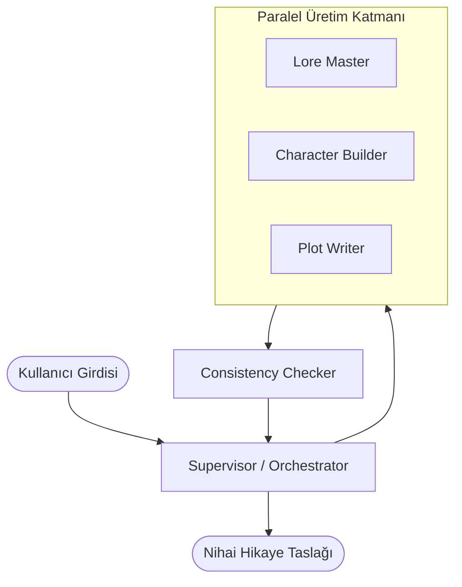

# Multi-Agent Story and World-Building Studio

Orkestrasyon ve Çoklu Ajan Sistemleri dersi kapsamında geliştirilmiş; yaratıcı yazarlık, evren inşası ve kurgu geliştirme odaklı multi-agent sistemi.

Sistem, tekil ve doğrusal bir komut zinciri yerine uzmanlaşmış alt ajanların paralel çalıştığı, çıktıların bağımsız bir denetim ajanı tarafından incelendiği ve bir süpervizör tarafından yönetildiği bir mimari kullanır.

## Mimari ve Ajanlar



### Ajan Rolleri

- **Supervisor (Orkestratör):** Kullanıcıdan gelen girdiyi alır, içerik üretici ajanları paralel olarak başlatır, sonuçları Consistency Checker'a iletir ve nihai çıktıyı derler.
- **Lore Master (Sub-Agent):** Evrenin coğrafi yapısını, tarihini, toplumsal düzenini ve temel kurallarını oluşturur.
- **Character Builder (Sub-Agent):** Hikayedeki karakterlerin arketiplerini, psikolojik hedeflerini, geçmişlerini ve birbirleriyle olan ilişkilerini tanımlar.
- **Plot Writer (Sub-Agent):** Üç perdeli anlatı yapısını, ana çatışma noktalarını, doruk noktasını ve çözümü belirler.
- **Consistency Checker (Reflection Agent):** Üretilen evren kuralları, karakter motivasyonları ve olay örgüsünü karşılaştırarak mantık hatalarını, çelişkileri ve anlatım sorunlarını raporlar.

## Teknik Detaylar

- **Paralel Yürütme:** İçerik üretici ajanlar (Lore Master, Character Builder, Plot Writer) birbirini beklemeden eşzamanlı olarak çalışır.
- **Biçim ve Üslup Kısıtlamaları:** Ajanların sistem promptlarında em-dash (—), üçlemeler ve yapay kontrast kalıpları ("it is not x, it is y" vb.) açıkça sınırlandırılmıştır.
- **Platform Desteği:** Sistem hem MySkillOS (`.myskillos/skill.json`) hem de Claude CLI (`.claude/agents/` ve `claude-agents-cli.json`) üzerinden çalıştırılabilir.

## Dizin Yapısı

```text
├── .claude/
│   └── agents/
│       ├── character-builder.md
│       ├── consistency-checker.md
│       ├── lore-master.md
│       └── plot-writer.md
├── .myskillos/
│   └── skill.json
├── claude-agents-cli.json
├── CLAUDE.md
└── README.md
```

## Kullanım

### MySkillOS
1. MySkillOS platformunda yeni bir proje veya çalışma alanı açın.
2. `.myskillos/skill.json` dosyasını içeri aktarın.
3. Giriş parametrelerini belirleyerek akışı başlatın.

### Claude CLI
1. `CLAUDE.md` ve `.claude/agents` dizinindeki tanımları kullanarak ana süpervizör üzerinden akışı tetikleyin.
